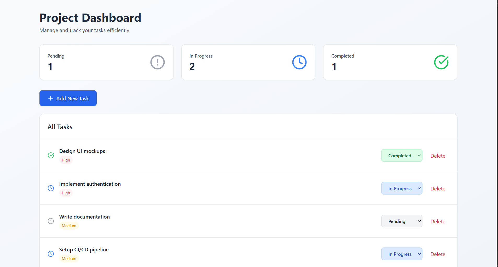

# Project Management Dashboard https://project-dashboard-ki1tw1jjl-nazeeha-farvins-projects.vercel.app/

A simple and intuitive project management dashboard built with React that helps you track and manage tasks efficiently.

## Features

-  **Task Management** - Create, update, and delete tasks
-  **Status Tracking** - Track tasks across three statuses: Pending, In Progress, and Completed
-  **Priority Levels** - Assign priority levels (Low, Medium, High) to tasks
-  **Dashboard Statistics** - View real-time counts of tasks by status
-  **Modern UI** - Clean and responsive design with Tailwind CSS
-  **Real-time Updates** - Instantly see changes reflected in the dashboard

## Screenshots



## Technologies Used

- **React** - Frontend library for building user interfaces
- **Tailwind CSS** - Utility-first CSS framework for styling
- **Lucide React** - Beautiful icon library
- **Create React App** - Build tooling and development server

## Prerequisites

Before you begin, ensure you have installed:
- [Node.js](https://nodejs.org/) (version 14 or higher)
- npm (comes with Node.js)

## Installation

1. Clone the repository or download the project files

```bash
git clone <your-repository-url>
cd project-dashboard
```

2. Install dependencies

```bash
npm install
```

3. Install additional required packages

```bash
npm install lucide-react
npm install -D tailwindcss@3 postcss autoprefixer
```

4. Create `tailwind.config.js` in the project root

```js
module.exports = {
  content: [
    "./src/**/*.{js,jsx,ts,tsx}",
  ],
  theme: {
    extend: {},
  },
  plugins: [],
}
```

5. Create `postcss.config.js` in the project root

```js
module.exports = {
  plugins: {
    tailwindcss: {},
    autoprefixer: {},
  },
}
```

6. Update `src/index.css` with Tailwind directives

```css
@tailwind base;
@tailwind components;
@tailwind utilities;
```

## Running the Application

Start the development server:

```bash
npm start
```

The app will open automatically in your browser at [http://localhost:3000](http://localhost:3000)

## Building for Production

Create an optimized production build:

```bash
npm run build
```

The build files will be in the `build` folder, ready for deployment.

## Usage

### Adding a Task
1. Click the "Add New Task" button
2. Enter the task title
3. Select a priority level (Low, Medium, High)
4. Click "Add Task"

### Updating Task Status
1. Find the task in the list
2. Click the status dropdown
3. Select the new status (Pending, In Progress, or Completed)

### Deleting a Task
1. Find the task you want to remove
2. Click the "Delete" button

### Viewing Statistics
The dashboard displays three cards at the top showing:
- Number of Pending tasks
- Number of In Progress tasks
- Number of Completed tasks


## Project Structure

```
project-dashboard/
├── public/
├── src/
│   ├── App.js          # Main dashboard component
│   ├── index.js        # Entry point
│   └── index.css       # Global styles with Tailwind
├── package.json
├── tailwind.config.js
├── postcss.config.js
└── README.md
```

## Customization

### Changing Colors
Edit the Tailwind classes in `src/App.js` to customize the color scheme.

### Adding New Status Types
Modify the status options in the dropdown selects and update the `getStatusColor` and `getStatusIcon` functions.

### Adding More Task Fields
Extend the task object in the `useState` initialization to include additional fields like due dates, assignees, or descriptions.

## Troubleshooting

### Tailwind styles not working
Make sure you've:
1. Installed Tailwind CSS v3
2. Created both `tailwind.config.js` and `postcss.config.js`
3. Added Tailwind directives to `src/index.css`
4. Restarted the development server

### Module not found errors
Run `npm install` to ensure all dependencies are installed.

### Port already in use
If port 3000 is already in use, the app will prompt you to use another port. Press 'Y' to continue.

## Contributing

Contributions are welcome! Please feel free to submit a Pull Request.

## License

This project is open source and available under the [MIT License](LICENSE).

## Contact

For questions or feedback, please open an issue in the repository.

---

**Made with ❤️ using React and Tailwind CSS**
